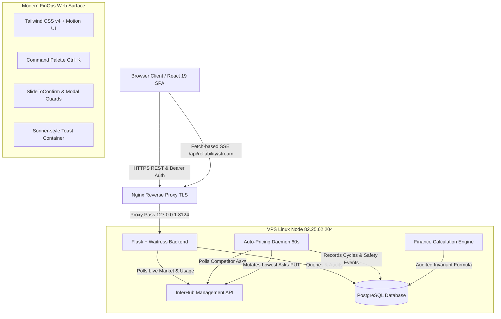

<!-- markdownlint-disable MD013 -->

# Upstream Dashboard — FinOps & Autonomous Pricing Control Plane

> **Enterprise-Grade SaaS Operations Platform** for multi-provider AI model pricing publishers, real-time reliability telemetry, PostgreSQL-authoritative financial operations, and autonomous market undercut pricing engines.

[](https://github.com/fazulfi/upstream-dashboard/actions/workflows/ci.yml)
[-success)](https://github.com/fazulfi/upstream-dashboard)
[](https://github.com/fazulfi/upstream-dashboard/actions/workflows/ci.yml)
[](https://upstream-static.vercel.app)
[](LICENSE)

---

## 📑 Executive Overview

**Upstream Dashboard** is an enterprise operations console engineered for high-throughput AI API publishers on InferHub. It consolidates provider fleet health, real-time market orderbooks, P&L statement generation, asset amortizations, settlement reconciliations, and autonomous dynamic pricing into a unified, authenticated, high-performance interface.

- **Frontend Surface**: Hosted on Vercel Edge (`upstream-static.vercel.app`) with Tailwind CSS v4, Motion spring physics, dark/light FinOps design language, and Command Palette (`Ctrl+K`).
- **Backend API**: Flask + Waitress running on dedicated VPS infrastructure behind Nginx TLS (`82.25.62.204` / `ops.budgezen.com`).
- **Durable Store**: PostgreSQL (`memory` schema) serving as the single source of truth for financial records, pricing parameters, asset inventory, and reliability history.

---

## 🏛️ System Architecture



---

## 🌟 Core Enterprise Modules

### 1. Reliability & Daemon Operations Room (`/`)
- **Real-Time Telemetry**: Fetch-based Server-Sent Events (SSE) with `Last-Event-ID` cursor recovery and heartbeat freshness tracking.
- **Production Arm/Disarm**: Slide-to-confirm safety toggle transitioning the autonomous pricing daemon between `ARMED` (live PUT mutations) and `DISARMED` (dry-run simulation).
- **Model Coverage Grid**: Searchable snapshot of all active provider models, current asks, competitor reference prices, and update actions.
- **Audit Timeline**: Persisted security events with severity filters (`info`, `warning`, `error`, `critical`).

### 2. Finance & Profitability Hub (`/finance`) — *Phase 3 Hub*
- **Authoritative P&L Equation**: Strictly calculated via the single-source-of-truth rule engine:
  $$\text{Net Income} = \text{Confirmed Payouts} + \text{Refunds} - \text{Amortizations} - \text{Impairments} - \text{Opex}$$
- **Asset Inventory Explorer**: Tracking CAPEX assets (`A-001` through `A-069`), purchase currency, unit cost, live IDR/USD exchange rate (`17,801.17`), and lifecycle status (`active`, `retired`, `refunded`).
- **Payout & Settlement Ledger**: Live USDC withdrawal records verified against PostgreSQL tables with zero-variance reconciliation.
- **Multi-Currency Converter**: Real-time toggle between USD (`$`) and IDR (`Rp`).

### 3. Autonomous Pricing Engine (`/auto-pricing`)
- **Tic-by-Tic Market Undercut**: Automatically tracks competitor floor prices and places asks to retain market leadership.
- **Global & Per-Model Thresholds**: Configurable trigger percentages (uniform default 10%) per upstream with granular per-model overrides.
- **Upstream Scope Toggles**: Dynamically include or exclude upstream providers (e.g. `codebuddy`, `codebuddy-cn`, `cline-pass`, `commandcode`, `opencode-go`) from automated execution loops.
- **Daemon Execution Terminal**: Live output viewer displaying the last 80 pricing cycles with instant clipboard copy.

### 4. Manual Pricing & Orderbook Depth (`/pricing`)
- **Market Spread Visualizer**: Real-time aggregated orderbook displaying min ask, max ask, spread delta, and visual market depth bars.
- **Manual Ask Overrides**: Direct PUT endpoint with operator audit logging and idempotency key enforcement.
- **Upstream Economics**: Per-upstream revenue share and maximum ask caps.

### 5. Platform Diagnostics & Security Gate (`/settings`)
- **Session Authentication**: Password-authenticated 24h bearer tokens stored in browser memory without exposing raw credentials.
- **Bento-Grid Diagnostics**: Live fleet summary, data refresh cadences, environment health, and multi-tier deployment status.
- **Decision-Grade Verification**: Automated reconciliation check between PostgreSQL schema and downstream artifacts.

---

## 🛠️ Technology Stack

| Layer | Technologies | Purpose |
| :--- | :--- | :--- |
| **Frontend Framework** | React 19, Vite 8, React Router 7 (`HashRouter`) | Core Single-Page Application |
| **Styling & Design System** | Tailwind CSS v4, Motion (`motion`), Lucide Icons | Linear/Geist FinOps dark/light UI |
| **Data & Visualization** | TanStack Table v9, Recharts | Interactive sortable tables & analytics |
| **Testing & Quality** | Vitest 3, Testing Library, jsdom, Oxlint | 100% automated test coverage |
| **Backend Framework** | Python 3.12, Flask, Waitress, Psycopg 3 | High-throughput authenticated API |
| **Backend Quality** | Pytest, Fail-Closed Security, Mutation Guard | Production-grade regression tests |
| **Database** | PostgreSQL (`memory` schema) | Authoritative financial & audit store |
| **Infrastructure** | Nginx TLS, Systemd Daemons, Vercel Edge | Production hybrid deployment |

---

## 🔌 API Specification & Endpoints

All mutating requests require a valid Bearer Session Token (`Authorization: Bearer <token>`) and support `Idempotency-Key` headers.

| Method | Endpoint | Description | Auth Required |
| :--- | :--- | :--- | :---: |
| `POST` | `/api/login` | Authenticate with dashboard password; issues 24h token | No |
| `GET` | `/api/data` | Aggregate balance, fleet summary, and refreshed timestamp | Optional |
| `GET` | `/api/finance` | Authoritative P&L breakdown, assets, and kurs meta | Optional |
| `GET` | `/api/payouts` | Withdrawal history and verified payout ledger | Optional |
| `GET` | `/api/auto-pricing` | Current cycle snapshot, model states, and daemon logs | Optional |
| `POST` | `/api/auto-pricing/arm` | Transition daemon between ARMED and DISARMED | **Yes** |
| `PUT` | `/api/auto-pricing/config` | Set per-model trigger percentage threshold | **Yes** |
| `DELETE`| `/api/auto-pricing/config/:id` | Reset model trigger percentage back to default | **Yes** |
| `PUT` | `/api/auto-pricing/scope` | Toggle upstream in/out of auto-pricing scope | **Yes** |
| `PUT` | `/api/pricing/global` | Update upstream max ask cap and global trigger % | **Yes** |
| `PUT` | `/api/ask` | Set manual price ask for a specific model | **Yes** |
| `GET` | `/api/reliability/stream` | Server-Sent Events stream for real-time telemetry | Optional |

---

## 🚀 Development & Testing

### Prerequisites
- Node.js `>= 20.x` & `npm`
- Python `>= 3.10` & `pip`
- PostgreSQL `>= 15.x`

### 1. Frontend Setup
```bash
cd frontend
npm install

# Run Vite development server
npm run dev

# Run Vitest test suites
npm test

# Build production bundle
npm run build
```

### 2. Backend Setup
```bash
cd backend
python -m venv .venv
source .venv/bin/activate  # On Windows: .venv\Scripts\activate
pip install -r requirements.txt

# Run backend API server
python app.py

# Run Pytest suite
pytest tests
```

---

## 🔒 Enterprise Security & Governance

- **Zero-Credential Bundling**: Client builds never contain passwords or raw secrets. All administrative operations flow through bearer tokens.
- **Fail-Closed Mutation Guards**: All pricing and daemon state changes are verified for operator authorization, idempotency keys, and audit logging.
- **Release Governance Policy**: CI-only automated validation (no auto-deploy on push). Production deployments require explicit staging verification, database backup, and post-deploy evidence capture.

---

## 📄 License

Distributed under the **MIT License**. See [`LICENSE`](LICENSE) for more information.
